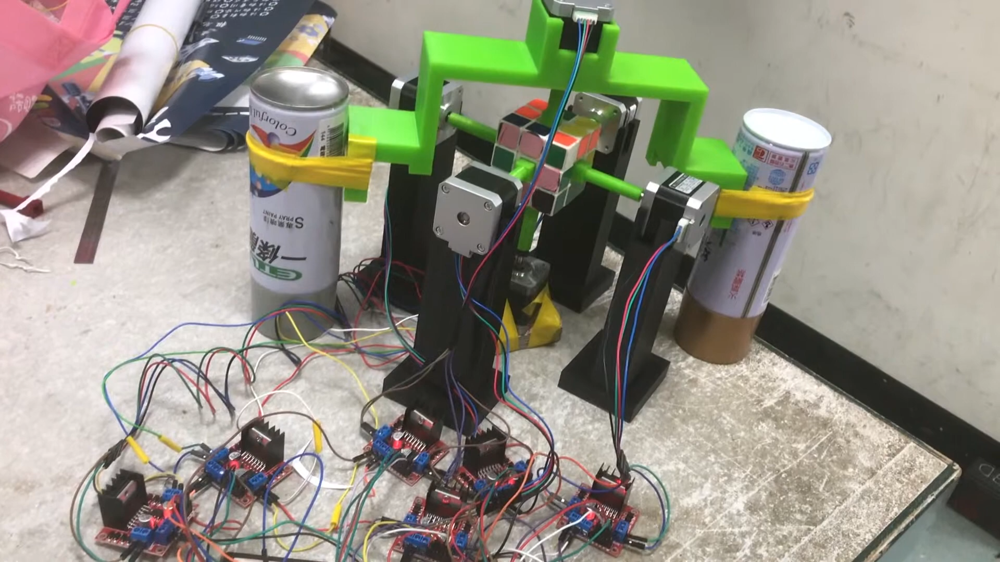

# 3by3CubeSolver

A comprehensive Rubik's Cube solver application with visual recognition capabilities and a graphical user interface.

[](https://youtu.be/7RalEq9f3NY)

[Watch the demo video](https://youtu.be/7RalEq9f3NY)

## Overview

This project combines computer vision (OpenCV), artificial intelligence algorithms, and physical automation to detect, solve, and potentially control a physical robot to solve a Rubik's cube. The system is capable of:

1. Visually detecting the state of a Rubik's cube through a webcam
2. Manually entering cube state through an interactive GUI
3. Generating optimal solution sequences using multiple solving algorithms
4. Visualizing the cube state and solution steps
5. Controlling a physical robot to execute the solution (with compatible hardware)

## Features

### Visual Detection

- Real-time cube face detection using OpenCV
- Automatic color recognition and state mapping
- Support for 3x3 Rubik's cubes (with extensible framework for other sizes)
- Robust detection even in varying lighting conditions

### Graphical Interface

- Interactive cube state editor
- 2D visualization of the cube state
- Solution display with move notation
- Manual color input options
- Visual identification mode for camera-based detection

### Solving Algorithms

- Implementation of Kociemba's two-phase algorithm
- CFOP (Cross, F2L, OLL, PLL) solving method
- Support for solution optimization

### Hardware Integration

- Contains 3D model files for building a physical cube-solving robot
- Integration with stepper motors for physical manipulation
- Arduino code for controlling the physical robot assembly

## Requirements

- Python 3.6+
- OpenCV (for visual detection)
- Tkinter (for GUI)
- NumPy
- rubik-solver
- pycuber

## Usage

### GUI Mode

Run the graphical interface with:

```
python guitest.py
```

The interface allows you to:
- Manually set the colors of each cube face
- Generate and visualize solving sequences
- Apply random moves to scramble a cube
- Solve from current state
- Use visual identification mode to detect cube state through a camera

### Visual Detection Mode

Run the visual detection with:

```
python colordetect.py
```

This will activate your webcam to detect and analyze Rubik's cube faces.

### Physical Robot Integration

If you have built the compatible hardware:

```
python rotest.py "sequence of moves"
```

Where "sequence of moves" is the notation for the solution (e.g., "R U R' U'").

## Project Structure

- `__init__.py`: Core implementation of visual detection algorithms
- `colordetect.py`: Webcam-based color detection module
- `guitest.py`: Main GUI application
- `cube.py`: Cube state representation
- `rotest.py`: Robot control interface
- `Cube_Solver/`: 3D models for physical robot construction
- `src/`: Source code for computer vision components

## Credits

This project incorporates:
- OpenCV for computer vision
- Kociemba algorithm for cube solving
- CFOP solver implementation
- Robot designs based on the Cube Solver by Luckycube (see Cube_Solver/LICENSE.txt)

## License

See the individual license files in the project for licensing information.